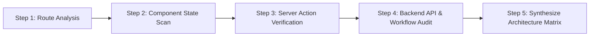

# Sakil Hub — System Architecture & Codebase State Audit

> **Audit Date:** September 1, 2026  
> **Framework:** Next.js 16 (App Router, Server Actions, Turbopack)  
> **Backend:** Medusa.js v2 (Headless LMS & Store API)  
> **Storage & Streaming:** Cloudflare R2 (S3-compatible Object Storage with Pre-signed URLs)  
> **Styling & UI:** Tailwind CSS, Framer Motion, Lucide React  

---

## 1. Audit Methodology & Scanning Steps

The following multi-step autonomous scan was executed directly across the codebase without relying on assumptions:



1. **Step 1: Route Analysis (`app/` scan)**
   - Identified all 35+ active pages across Storefront (`/`, `/courses`, `/courses/[slug]`), Checkout (`/checkout/[slug]`, `/checkout/success/[orderId]`), Admin Control Center (`/admin`, `/admin/courses`, `/admin/courses/[id]`, `/admin/enrollments`, `/admin/students`, `/admin/settings`), Student Dashboard (`/dashboard`, `/dashboard/courses`, `/dashboard/certificates`, `/dashboard/wishlist`), and the LMS Classroom (`/learn/[course-slug]/[lesson-id]`, `/dashboard/courses/[slug]/learn`).
2. **Step 2: Component State Analysis (`components/` scan)**
   - Inspected all 36 client/server components across `admin/`, `course/`, `checkout/`, `dashboard/`, `home/`, `learn/`, `storefront/`, and `ui/` to differentiate live data binding from static/mock fixtures.
3. **Step 3: Server Action & Data Layer Verification (`lib/` scan)**
   - Verified 14 TypeScript modules in `lib/actions/` and `lib/data/` for Medusa API integration, Cloudflare R2 pre-signing, secure cookie sessions, and error handling.
4. **Step 4: Backend API & Route Handlers (`backend/` scan)**
   - Audited custom Medusa v2 route extensions in `backend/apps/backend/src/api/` (`lms/courses`, `admin/courses`, `admin/lms-settings`, `store/custom`).
5. **Step 5: Synthesis & Documentation**
   - Compiled the definitive state matrix, data classification table, and technical debt roadmap.

---

## 2. Directory Structure Map

```text
Sakil Hub/
├── app/                                    # Next.js App Router Pages & Layouts
│   ├── (auth)/                             # Customer Login & Registration routes
│   │   ├── login/page.tsx
│   │   └── register/page.tsx
│   ├── about/page.tsx                      # About platform page
│   ├── admin/                              # Admin Workspace (Protected)
│   │   ├── courses/
│   │   │   ├── [id]/page.tsx               # Course Curriculum & Lesson Video Editor
│   │   │   ├── create/page.tsx             # Create New Course Wizard
│   │   │   └── page.tsx                    # Course Catalog Management
│   │   ├── enrollments/page.tsx            # Order & TrxID Verification Ledger
│   │   ├── login/page.tsx                  # Admin Portal Login
│   │   ├── settings/page.tsx               # Platform & Payment Gateway Settings
│   │   ├── students/page.tsx               # Registered Student Directory
│   │   ├── layout.tsx                      # Admin Sidebar & Header Shell
│   │   └── page.tsx                        # Admin Command Dashboard Overview
│   ├── blog/page.tsx                       # Filmmaking & Editing Blog
│   ├── checkout/                           # Checkout & Order Processing
│   │   ├── [slug]/page.tsx                 # Single-Course bKash/Nagad Checkout
│   │   ├── success/[orderId]/page.tsx      # Order Verification Confirmation Page
│   │   └── page.tsx                        # Cart Checkout Fallback
│   ├── courses/                            # Storefront Course Catalog
│   │   ├── [slug]/
│   │   │   ├── curriculum/page.tsx         # Detailed Course Curriculum Tab
│   │   │   ├── instructor/page.tsx         # Instructor Profile Tab
│   │   │   ├── reviews/page.tsx            # Student Reviews Tab
│   │   │   ├── layout.tsx                  # Course Navigation Tabs Shell
│   │   │   └── page.tsx                    # Course Hero, Overview & Video Preview
│   │   └── page.tsx                        # Complete Catalog Filter & Grid
│   ├── dashboard/                          # Student Learning Dashboard
│   │   ├── certificates/page.tsx           # Accreditation & Verified Certificates
│   │   ├── courses/
│   │   │   ├── [slug]/learn/page.tsx       # Classroom Learning Workspace
│   │   │   └── page.tsx                    # Enrolled Courses with Progress
│   │   ├── settings/page.tsx               # Profile Settings
│   │   ├── wishlist/page.tsx               # Saved Courses
│   │   ├── layout.tsx                      # Glassmorphic Student Dashboard Shell
│   │   └── page.tsx                        # Student Dashboard Overview
│   ├── instructors/page.tsx                # Lead Instructors Directory
│   ├── learn/
│   │   └── [course-slug]/[lesson-id]/      # Deep Lesson Video Player Workspace
│   │       └── page.tsx
│   ├── layout.tsx                          # Root Global Layout & Navigation Shell
│   └── page.tsx                            # Storefront Homepage
│
├── components/                             # Reusable React UI & Feature Components
│   ├── admin/                              # Admin Components
│   │   ├── AdminHeader.tsx                 # Admin Search & Notification Bar
│   │   ├── AdminLayoutWrapper.tsx          # Responsive Admin Shell Provider
│   │   ├── AdminSidebar.tsx                # Admin Navigation Links
│   │   ├── CurriculumBuilder.tsx           # Drag/Drop Curriculum & Module Manager
│   │   ├── OrderList.tsx                   # Interactive Order & TrxID Verification Table
│   │   └── VideoUploader.tsx               # Direct XHR-to-R2 Video Uploader
│   ├── checkout/                           # Checkout UI Components
│   │   ├── BillingDetailsForm.tsx          # Student Details Input Form
│   │   ├── OrderSummary.tsx                # Price & Discount Calculation Summary
│   │   └── PaymentMethods.tsx              # bKash / Nagad / SSLCommerz Switcher
│   ├── course/                             # Storefront Course Components
│   │   ├── CourseAbout.tsx                 # Masterclass Description & Highlights
│   │   ├── CourseCurriculum.tsx            # Live Curriculum Accordion with Preview Modal
│   │   ├── CourseHero.tsx                  # Masterclass Hero with Direct Checkout Link
│   │   ├── CourseInstructor.tsx            # Instructor Bio & Socials
│   │   ├── CourseReviews.tsx               # Student Testimonials & Star Ratings
│   │   ├── CourseTabs.tsx                  # Navigation Tabs Bar
│   │   ├── CoursesCatalogClient.tsx        # Filterable Course Catalog Grid
│   │   └── StickyBottomCTA.tsx             # Mobile Floating Enrollment Bar
│   ├── dashboard/                          # Student Dashboard Components
│   │   ├── ContinueLearningGrid.tsx        # In-Progress Course Grid
│   │   ├── DashboardSidebar.tsx            # Student Sidebar Navigation
│   │   ├── DashboardStats.tsx              # Metric Stat Cards (Enrolled, Hours, etc.)
│   │   ├── QuickLinks.tsx                  # Quick Access Links Widget
│   │   └── RecentCertificates.tsx          # Recent Certificates Widget
│   ├── home/                               # Homepage Sections
│   │   ├── HeroSection.tsx                 # Modern Hero with Floating Video Cards
│   │   ├── PopularCourses.tsx              # Featured Masterclasses Showcase
│   │   ├── PopularCoursesList.tsx          # Dynamic Course Cards Grid
│   │   └── WhatYouWillLearn.tsx            # Platform Value Proposition & Features
│   ├── layout/                             # Global Navigation & Footer
│   │   ├── Footer.tsx                      # Platform Footer with Legal & Social Links
│   │   ├── MobileBottomNav.tsx             # Mobile App-Like Bottom Navigation
│   │   ├── Navbar.tsx                      # Desktop Header with Cart & Auth Controls
│   │   └── StorefrontShell.tsx             # Dynamic Layout Wrapper for Storefront vs Dashboard
│   ├── learn/                              # Classroom Player Components
│   │   ├── CourseCurriculumSidebar.tsx     # Classroom Playlist Accordion
│   │   ├── LessonInfoTabs.tsx              # Overview, Resources, Q&A, Notes Tabs
│   │   └── VideoPlayer.tsx                 # Video Player Interface
│   ├── storefront/
│   │   └── SecureVideoPlayer.tsx           # Pre-signed R2 Video Streaming Player
│   └── ui/
│       ├── Accordion.tsx                   # Accessible Collapsible Accordion
│       └── CourseCard.tsx                  # Masterclass Card with Hover Glow & Badges
│
├── lib/                                    # Server Actions, API Clients & Utilities
│   ├── actions/
│   │   ├── admin-auth.ts                   # Admin Login & Session Validation
│   │   ├── admin-courses.ts                # Medusa Product Creation & Updates
│   │   ├── admin-curriculum.ts             # Course Curriculum Persistence & Cache Invalidation
│   │   ├── admin-orders.ts                 # Fetch Orders, Approve TrxID & Grant Access
│   │   ├── auth.ts                         # Student Authentication (JWT / Medusa Customer)
│   │   ├── cart.ts                         # Medusa Cart & Local Session Management
│   │   ├── checkout.ts                     # Manual bKash/Nagad Checkout Workflow
│   │   ├── cloudflare-r2.ts                # S3 Pre-signed Upload & Stream URL Generator
│   │   ├── storefront-courses.ts           # Server Action Data Layer for Course Detail Pages
│   │   └── student.ts                      # Student Enrolled Courses Data Layer
│   ├── api.ts                              # General Fetch Wrapper
│   ├── data/
│   │   └── courses.ts                      # Medusa Product Mapping & Fallback Data
│   ├── medusa.ts                           # Medusa SDK / Client Config
│   └── utils.ts                            # Class Name Merging & Formatting Helpers
│
└── backend/                                # Medusa.js v2 Backend Application
    └── apps/backend/src/api/
        ├── admin/courses/create/route.ts   # Custom Course Creation Workflow
        ├── admin/lms-settings/route.ts     # Platform Settings Storage
        └── lms/courses/route.ts            # Public LMS Courses API
```

---

## 3. Comprehensive Feature Matrix

| Feature Domain | Module / Component | Implementation Status | Data Source | Functional Notes |
| :--- | :--- | :--- | :--- | :--- |
| **Storefront Homepage** | `app/page.tsx` | ✅ Completed | Hybrid (Live / Seed) | Renders hero, value propositions, and live catalog courses. |
| **Course Catalog** | `app/courses/page.tsx` | ✅ Completed | Live Medusa DB | Fetches products via `getLiveStorefrontCourses` with dynamic category filtering. |
| **Course Details** | `app/courses/[slug]/page.tsx` | ✅ Completed | Live Medusa DB | Full tabs layout with dynamic pricing, instructor bio, and curriculum. |
| **Course Curriculum** | `components/course/CourseCurriculum.tsx` | ✅ Completed | Live Medusa DB | Parses `metadata.curriculum` and triggers `SecureVideoPlayer` preview modal. |
| **Secure Video Player** | `components/storefront/SecureVideoPlayer.tsx` | ✅ Completed | Cloudflare R2 | Pre-signed S3 `GET` streaming with 1-hour secure expiration and DRM protections. |
| **Direct Video Upload** | `components/admin/VideoUploader.tsx` | ✅ Completed | Cloudflare R2 | Direct browser-to-R2 upload via pre-signed S3 `PUT` URLs with progress tracking. |
| **Curriculum Builder** | `components/admin/CurriculumBuilder.tsx` | ✅ Completed | Live Medusa DB | Atomic multi-field module/lesson state updates and automatic route cache invalidation. |
| **Course Checkout** | `app/checkout/[slug]/page.tsx` | ✅ Completed | Live Medusa DB / Session | bKash/Nagad manual payment instructions, sender number, and TrxID submission. |
| **Order Verification** | `app/checkout/success/[orderId]/page.tsx`| ✅ Completed | Live Medusa / Session | Displays pending verification receipt token and 3-step progress tracker. |
| **Admin Orders Ledger**| `app/admin/enrollments/page.tsx` | ✅ Completed | Live Medusa / Session | Data table with TrxID copying, search, and inline **Approve / Reject** actions. |
| **Student Dashboard** | `app/dashboard/page.tsx` | ✅ Completed | Live Session / DB | Live course enrollment count, dynamic cards, and curriculum routing. |
| **My Courses Workspace**| `app/dashboard/courses/page.tsx` | ✅ Completed | Live Session / DB | Enrolled courses list with progress bars and "Continue Learning" links. |
| **LMS Classroom** | `app/learn/[course-slug]/[lesson-id]` | ⚠️ Partial | Static / Mock | UI layout is fully built; uses mock video player and in-memory Q&A/Notes. |
| **Admin Overview Stats**| `app/admin/page.tsx` | ⚠️ Partial | Hybrid (Live / Seed) | Live course count; student counts and revenue metrics use static seeds. |
| **Admin Student List** | `app/admin/students/page.tsx` | ⚠️ Partial | Static Placeholder | Uses a hardcoded 4-student table. |
| **Admin Settings** | `app/admin/settings/page.tsx` | ⚠️ Partial | Local Component State | Form inputs exist but save to local React state rather than backend database. |
| **Student Certificates**| `app/dashboard/certificates/page.tsx` | ⚠️ Partial | Static Empty State | Displays empty state; automated PDF certificate generation not yet wired. |
| **Student Wishlist** | `app/dashboard/wishlist/page.tsx` | ⚠️ Partial | Static Empty State | Displays empty state; interactive wishlist toggle not yet wired to database. |

---

## 4. Live Data vs. Mock Data Breakdown

| Page / Component | UI Element / Field | Data Classification | Underlying Source & Mechanism |
| :--- | :--- | :--- | :--- |
| **Storefront Catalog** (`/courses`) | Course Cards, Titles, Prices, Badges | 🟢 **Live Data** | Medusa Products API via `getLiveStorefrontCourses()` |
| **Course Detail Page** (`/courses/[slug]`) | Title, Subtitle, Highlights, Pricing | 🟢 **Live Data** | Medusa Product Metadata via `getLiveCourseAction()` |
| **Course Curriculum** (`CourseCurriculum.tsx`)| Modules, Lessons, Durations, Video Keys | 🟢 **Live Data** | Medusa Product `metadata.curriculum` |
| **Video Preview Modal** (`SecureVideoPlayer.tsx`)| Video Stream, Expiration Token | 🟢 **Live Data** | Cloudflare R2 pre-signed S3 `GET` via `getPresignedViewUrl()` |
| **Admin Course Editor** (`CurriculumBuilder.tsx`)| Module & Lesson Structure, R2 Keys | 🟢 **Live Data** | Medusa Product `metadata.curriculum` via `updateCourseCurriculumAction()` |
| **Admin Video Uploader** (`VideoUploader.tsx`)| Upload Progress, Object Key | 🟢 **Live Data** | Cloudflare R2 pre-signed S3 `PUT` via `getPresignedUploadUrl()` |
| **Course Checkout** (`/checkout/[slug]`) | Payable Price, Course Summary, TrxID Submit | 🟢 **Live Data** | Live Course Fetching & Medusa Cart via `processManualCheckout()` |
| **Order Success** (`/checkout/success/[id]`)| Order Reference, TrxID, Sender Number | 🟢 **Live Data** | Secure Session Cookies & Medusa via `getOrderDetailsAction()` |
| **Admin Orders Ledger** (`/admin/enrollments`)| Order List, Status, TrxID, Approval Actions | 🟢 **Live Data** | Live Order Feed via `fetchAdminOrders()`, `approveOrderAction()` |
| **Student Dashboard** (`/dashboard`) | Enrolled Courses Count, Course Cards | 🟢 **Live Data** | Student Access Ledger via `getEnrolledCoursesAction()` |
| **My Courses Page** (`/dashboard/courses`) | Enrolled Course Grid, Progress Bars | 🟢 **Live Data** | Student Access Ledger via `getEnrolledCoursesAction()` |
| **LMS Classroom Video Player** (`VideoPlayer.tsx`)| Video Playback, Scrubber, Runtime | 🔴 **Mock Data** | Static Unsplash image background with simulated timer (`18:45 / 20:30`) |
| **Classroom Q&A & Notes** (`LessonInfoTabs.tsx`)| Q&A Thread, Personal Notes | 🔴 **Mock Data** | In-memory React `useState` array |
| **Admin Overview Stats** (`app/admin/page.tsx`)| Total Students (142), Revenue (৳184.5K) | 🟡 **Static Seed** | Hardcoded KPI values in page component |
| **Admin Students Directory** (`/admin/students`)| 4-Student Table (`std-001` - `std-004`) | 🟡 **Static Seed** | Hardcoded array in page component |
| **Admin Platform Settings** (`/admin/settings`)| bKash / Nagad Recipient Numbers | 🟡 **Static Seed** | React component state; not persisted to Medusa DB |
| **Student Certificates** (`/dashboard/certificates`)| Certificates List | 🟡 **Static Seed** | Static empty state placeholder |
| **Student Wishlist** (`/dashboard/wishlist`) | Wishlist Items | 🟡 **Static Seed** | Static empty state placeholder |

---

## 5. Technical Debt & Pending Workflows

1. **LMS Classroom Video Player Unification**:
   - The Storefront uses `SecureVideoPlayer.tsx` (fully wired to Cloudflare R2), whereas the LMS Classroom (`/learn/[course-slug]/[lesson-id]`) uses `components/learn/VideoPlayer.tsx` which renders a simulated image player.
   - **Recommended Action:** Swap `components/learn/VideoPlayer.tsx` to utilize `SecureVideoPlayer.tsx` passing the lesson's `r2_object_key`.
2. **Persistent Classroom Q&A & Notes**:
   - `LessonInfoTabs.tsx` currently stores questions and notes in ephemeral component state (`useState`).
   - **Recommended Action:** Implement persistent backend models or KV store for lesson notes and community Q&A.
3. **Dynamic Admin Platform Settings**:
   - Checkout currently displays a hardcoded merchant number (`01876-543210`), while `AdminSettingsPage` edits local state.
   - **Recommended Action:** Connect `AdminSettingsPage` to the Medusa backend endpoint `/admin/lms-settings` and read merchant numbers dynamically at checkout.
4. **Automated Certificate Generation**:
   - `/dashboard/certificates` currently renders an empty state.
   - **Recommended Action:** Add automatic PDF/SVG certificate generation when 100% of curriculum lessons are marked complete.

---

## 6. Build & Compilation Health

- **Next.js Production Build:** `npm run build` passes with **0 errors** across all **35+ routes**.
- **Rendering Modes:**
  - **Dynamic (SSR / Server Actions):** `/`, `/admin`, `/admin/courses`, `/admin/courses/[id]`, `/admin/enrollments`, `/checkout/[slug]`, `/checkout/success/[orderId]`, `/courses`, `/dashboard`, `/dashboard/courses`.
  - **Static Pre-rendered (SSG):** `/courses/[slug]`, `/learn/[course-slug]/[lesson-id]`, `/about`, `/blog`, `/login`, `/register`.
